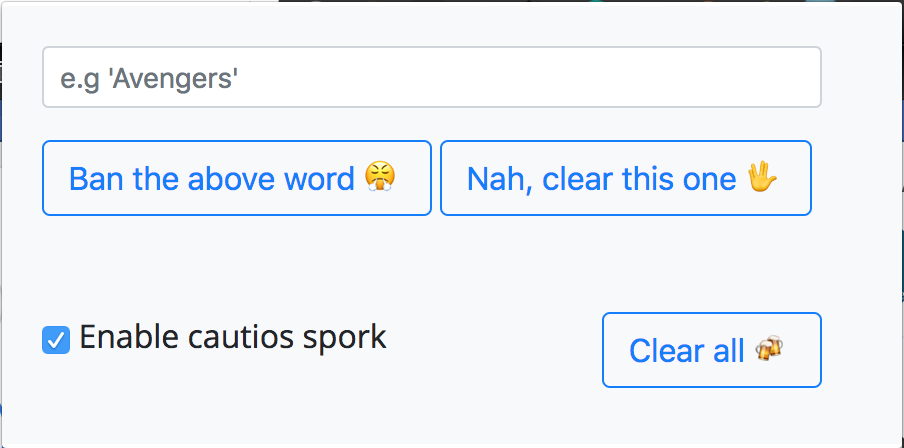

# cautious-spork


Tired of seeing the movie spoilers in fb ? A simple chrome-extension to block annoying posts in Facebook based on keywords.

### Usage
```bash
# Clone the repository
$ git clone https://github.com/sharathvignesh/cautious-spork.git
```

On Chrome:

* Go to `chrome://extensions/` > Load unpacked extension > `<cautious-spork folder path>`

* When you're active window is Facebook, the extension will be active.

* Type in the word you want to block, and click ban button.


That's it. You wont see anymore posts which has the above banned keyword in it.

#### Todo
- [ ] Push to Chrome app store.
- [ ] Show the existing words on the banned list.


